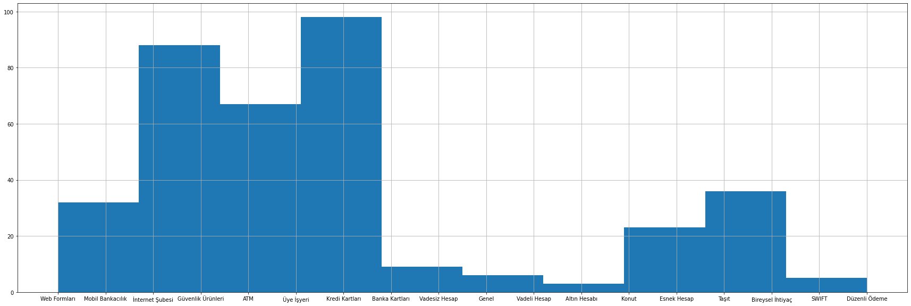
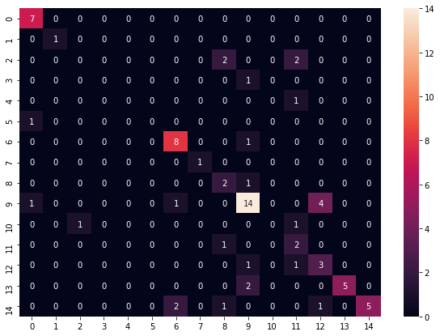

# FAQ Classification

Before I begin, I would like to thank my friend who brought this dataset together. You can check for the rest of his studies from <a href="https://github.com/CankutCoskun/semanticQuestionAnswerBot">here</a>.

```python
from google.colab import drive 
drive.mount("gdrive")
```

    Drive already mounted at gdrive; to attempt to forcibly remount, call drive.mount("gdrive", force_remount=True).
    


```python
import pandas as pd
import matplotlib.pyplot as plt
import numpy as np
import gensim.downloader
import nltk
import string 
import seaborn as sn
```


```python
df = pd.read_csv("labeled_qnas.csv",index_col=0)
```

Lets check what we have imported.


```python
df.head(-1)
```


<div>

<table border="1" class="dataframe">
  <thead>
    <tr style="text-align: right;">
      <th></th>
      <th>GroupId</th>
      <th>SubGroupId</th>
      <th>Categories</th>
      <th>Q&amp;A</th>
    </tr>
  </thead>
  <tbody>
    <tr>
      <th>0</th>
      <td>0</td>
      <td>0</td>
      <td>Web Formları</td>
      <td>Web sitesi üzerinden yaptığım başvuruyu nasıl ...</td>
    </tr>
    <tr>
      <th>1</th>
      <td>0</td>
      <td>0</td>
      <td>Web Formları</td>
      <td>Kredi kartı başvurumu nereden yapabilirim?\nTü...</td>
    </tr>
    <tr>
      <th>2</th>
      <td>0</td>
      <td>0</td>
      <td>Web Formları</td>
      <td>Web sitesi üzerinden yabancı uyruklu müşterile...</td>
    </tr>
    <tr>
      <th>3</th>
      <td>0</td>
      <td>0</td>
      <td>Web Formları</td>
      <td>Web sitesinden sadece yeni kredi kartı için mi...</td>
    </tr>
    <tr>
      <th>4</th>
      <td>0</td>
      <td>0</td>
      <td>Web Formları</td>
      <td>Kredi kartı şifremi nasıl belirleyebilirim?\nB...</td>
    </tr>
    <tr>
      <th>...</th>
      <td>...</td>
      <td>...</td>
      <td>...</td>
      <td>...</td>
    </tr>
    <tr>
      <th>361</th>
      <td>3</td>
      <td>3</td>
      <td>Bireysel İhtiyaç</td>
      <td>Başvuru için gerekli belgeler (aslı ve birer f...</td>
    </tr>
    <tr>
      <th>362</th>
      <td>4</td>
      <td>0</td>
      <td>SWIFT</td>
      <td>Swift kodu nedir?\nBankamız swift kodu YAPITRI...</td>
    </tr>
    <tr>
      <th>363</th>
      <td>4</td>
      <td>1</td>
      <td>Düzenli Ödeme</td>
      <td>Üniversite ödemelerimi nasıl gerçekleştirebili...</td>
    </tr>
    <tr>
      <th>364</th>
      <td>4</td>
      <td>1</td>
      <td>Düzenli Ödeme</td>
      <td>Sıkça yaptığım bir ödememin hesabımdan önceden...</td>
    </tr>
    <tr>
      <th>365</th>
      <td>4</td>
      <td>1</td>
      <td>Düzenli Ödeme</td>
      <td>Hesabımdan, bir yakınımın hesabına belli dönem...</td>
    </tr>
  </tbody>
</table>
<p>366 rows × 4 columns</p>
</div>


```python
df.info()
```

    <class 'pandas.core.frame.DataFrame'>
    Int64Index: 367 entries, 0 to 366
    Data columns (total 4 columns):
     #   Column      Non-Null Count  Dtype 
    ---  ------      --------------  ----- 
     0   GroupId     367 non-null    int64 
     1   SubGroupId  367 non-null    int64 
     2   Categories  367 non-null    object
     3   Q&A         367 non-null    object
    dtypes: int64(2), object(2)
    memory usage: 14.3+ KB
    

The dataset seems clean.


```python
df.GroupId.unique()
```


    array([0, 1, 2, 3, 4])


```python
df.SubGroupId.unique()
```


    array([0, 1, 2, 3, 4])


```python
df.Categories.unique()
```


    array(['Web Formları', 'Mobil Bankacılık', 'İnternet Şubesi',
           'Güvenlik Ürünleri', 'ATM', 'Üye İşyeri', 'Kredi Kartları',
           'Banka Kartları', 'Vadesiz Hesap', 'Genel', 'Vadeli Hesap',
           'Altın Hesabı', 'Konut', 'Esnek Hesap', 'Taşıt',
           'Bireysel İhtiyaç', 'SWIFT', 'Düzenli Ödeme'], dtype=object)


# Pre-processing


```python
df.drop(columns=["GroupId","SubGroupId"],inplace=True)
```

Actually, we dont need to work with Group and SubGroup columsn.


```python
df["Q&A"]
```


    0      Web sitesi üzerinden yaptığım başvuruyu nasıl ...
    1      Kredi kartı başvurumu nereden yapabilirim?\nTü...
    2      Web sitesi üzerinden yabancı uyruklu müşterile...
    3      Web sitesinden sadece yeni kredi kartı için mi...
    4      Kredi kartı şifremi nasıl belirleyebilirim?\nB...
                                 ...                        
    362    Swift kodu nedir?\nBankamız swift kodu YAPITRI...
    363    Üniversite ödemelerimi nasıl gerçekleştirebili...
    364    Sıkça yaptığım bir ödememin hesabımdan önceden...
    365    Hesabımdan, bir yakınımın hesabına belli dönem...
    366    Her ay yaptığım kira ödememin hesabımdan önced...
    Name: Q&A, Length: 367, dtype: object


We can deal with certain issues like endline and etc.


```python
for index, row in df.iterrows():
    if(index==5):
      break
    print(row[1])
    print("\n")
```

    Web sitesi üzerinden yaptığım başvuruyu nasıl takip edebilirim?
    Kredi kartı başvurunuzu web sitesinden Kredi Kartı Başvuru Sorgulama adımından hemen sorgulayabilirsniz. Başvurunuz varsa hemen sorgulamak için tıklayınız.
    
    
    Kredi kartı başvurumu nereden yapabilirim?
    Türkiye'nin en geniş kart portföyü olan World'e sahip olmak için şubeye gitmeden internetten, SMS ile veya Yapı Kredi Telefon Bankacılığı üzerinden başvuru yapabilirsiniz. Kredi kartına hemen başvurmak için tıklayınız.
    Diğer başvuru kanalları hakkında detaylı bilgi için tıklayınız.
    
    
    Web sitesi üzerinden yabancı uyruklu müşteriler şifre belirleyebilir mi?
    Evet, yabancı uyruklu müşterilerimiz bankamızda kayıtlı Yabancı Kimlik Numaralarını kullanarak şifre belirleyebilirler.
    
    
    Web sitesinden sadece yeni kredi kartı için mi şifre belirleyebilirim?
    Hayır, sadece yeni kartınız için değil, şifresini unuttuğunuz ya da değiştirmek istediğiniz kartınız için de şifre belirleme işlemi yapabilirsiniz.
    
    
    Kredi kartı şifremi nasıl belirleyebilirim?
    Bireysel veya Ticari kredi kartlarınız için kredi kart şifrenizi Yapı Kredi Web Sitesi, Bireysel İnternet Şubesi, Mobil Şube, Nuvo İnternet Bankacılığı ve SMS aracılığı ile belirleyebilirsiniz. Detaylı bilgi için tıklayınız.
    Belirlediğiniz şifre ile www.yapikredi.com.tr üzerinde yer alan "Kart İşlemlerim"e üye olabilirsiniz. Hesap özeti görüntüleme, kart borcu ödeme gibi kart işlemleriniz için Kart İşlemlerim adımından internet şubesi ve mobil şubeye giriş yapabilirsiniz.
    
    
    

## Punctuation Removal


```python
df["Q&A"]=df["Q&A"].str.replace('[{}]'.format(string.punctuation), '')
df.head(-1)
```


<div>

<table border="1" class="dataframe">
  <thead>
    <tr style="text-align: right;">
      <th></th>
      <th>Categories</th>
      <th>Q&amp;A</th>
    </tr>
  </thead>
  <tbody>
    <tr>
      <th>0</th>
      <td>Web Formları</td>
      <td>Web sitesi üzerinden yaptığım başvuruyu nasıl ...</td>
    </tr>
    <tr>
      <th>1</th>
      <td>Web Formları</td>
      <td>Kredi kartı başvurumu nereden yapabilirim\nTür...</td>
    </tr>
    <tr>
      <th>2</th>
      <td>Web Formları</td>
      <td>Web sitesi üzerinden yabancı uyruklu müşterile...</td>
    </tr>
    <tr>
      <th>3</th>
      <td>Web Formları</td>
      <td>Web sitesinden sadece yeni kredi kartı için mi...</td>
    </tr>
    <tr>
      <th>4</th>
      <td>Web Formları</td>
      <td>Kredi kartı şifremi nasıl belirleyebilirim\nBi...</td>
    </tr>
    <tr>
      <th>...</th>
      <td>...</td>
      <td>...</td>
    </tr>
    <tr>
      <th>361</th>
      <td>Bireysel İhtiyaç</td>
      <td>Başvuru için gerekli belgeler aslı ve birer fo...</td>
    </tr>
    <tr>
      <th>362</th>
      <td>SWIFT</td>
      <td>Swift kodu nedir\nBankamız swift kodu YAPITRIS...</td>
    </tr>
    <tr>
      <th>363</th>
      <td>Düzenli Ödeme</td>
      <td>Üniversite ödemelerimi nasıl gerçekleştirebili...</td>
    </tr>
    <tr>
      <th>364</th>
      <td>Düzenli Ödeme</td>
      <td>Sıkça yaptığım bir ödememin hesabımdan önceden...</td>
    </tr>
    <tr>
      <th>365</th>
      <td>Düzenli Ödeme</td>
      <td>Hesabımdan bir yakınımın hesabına belli döneml...</td>
    </tr>
  </tbody>
</table>
<p>366 rows × 2 columns</p>
</div>


## Lower Casing


```python
df["Q&A"]=df["Q&A"].str.lower()
df.head(-1)
```


<div>

<table border="1" class="dataframe">
  <thead>
    <tr style="text-align: right;">
      <th></th>
      <th>Categories</th>
      <th>Q&amp;A</th>
    </tr>
  </thead>
  <tbody>
    <tr>
      <th>0</th>
      <td>Web Formları</td>
      <td>web sitesi üzerinden yaptığım başvuruyu nasıl ...</td>
    </tr>
    <tr>
      <th>1</th>
      <td>Web Formları</td>
      <td>kredi kartı başvurumu nereden yapabilirim\ntür...</td>
    </tr>
    <tr>
      <th>2</th>
      <td>Web Formları</td>
      <td>web sitesi üzerinden yabancı uyruklu müşterile...</td>
    </tr>
    <tr>
      <th>3</th>
      <td>Web Formları</td>
      <td>web sitesinden sadece yeni kredi kartı için mi...</td>
    </tr>
    <tr>
      <th>4</th>
      <td>Web Formları</td>
      <td>kredi kartı şifremi nasıl belirleyebilirim\nbi...</td>
    </tr>
    <tr>
      <th>...</th>
      <td>...</td>
      <td>...</td>
    </tr>
    <tr>
      <th>361</th>
      <td>Bireysel İhtiyaç</td>
      <td>başvuru için gerekli belgeler aslı ve birer fo...</td>
    </tr>
    <tr>
      <th>362</th>
      <td>SWIFT</td>
      <td>swift kodu nedir\nbankamız swift kodu yapitris...</td>
    </tr>
    <tr>
      <th>363</th>
      <td>Düzenli Ödeme</td>
      <td>üniversite ödemelerimi nasıl gerçekleştirebili...</td>
    </tr>
    <tr>
      <th>364</th>
      <td>Düzenli Ödeme</td>
      <td>sıkça yaptığım bir ödememin hesabımdan önceden...</td>
    </tr>
    <tr>
      <th>365</th>
      <td>Düzenli Ödeme</td>
      <td>hesabımdan bir yakınımın hesabına belli döneml...</td>
    </tr>
  </tbody>
</table>
<p>366 rows × 2 columns</p>
</div>


## Stopwords Removal


```python
stopwords = []
with open("/content/gdrive/MyDrive/CS-445/stopwords-extended") as s_file:
  stopwords = s_file.readlines()
```


```python
stopwords = [stopword[:-1] for stopword in stopwords]
```


```python
stopwords
```


    ['acaba',
     'acep',
     'adamakıllı',
     'adeta',
     'ait',
     'altmýþ',
     'altmış',
     'altý',
     'altı',
     'ama',
     'amma',
     'anca',
     'ancak',
     'arada',
     'artýk',
     'aslında',
     'aynen',
     'ayrıca',
     'az',
     'açıkça',
     'açıkçası',
     'bana',
     'bari',
     'bazen',
     'bazý',
     'bazı',
     'başkası',
     'baţka',
     'belki',
     'ben',
     'benden',
     'beni',
     'benim',
     'beri',
     'beriki',
     'beþ',
     'beş',
     'beţ',
     'bilcümle',
     'bile',
     'bin',
     'binaen',
     'binaenaleyh',
     'bir',
     'biraz',
     'birazdan',
     'birbiri',
     'birden',
     'birdenbire',
     'biri',
     'birice',
     'birileri',
     'birisi',
     'birkaç',
     'birkaçı',
     'birkez',
     'birlikte',
     'birçok',
     'birçoğu',
     'birþey',
     'birþeyi',
     'birşey',
     'birşeyi',
     'birţey',
     'bitevi',
     'biteviye',
     'bittabi',
     'biz',
     'bizatihi',
     'bizce',
     'bizcileyin',
     'bizden',
     'bize',
     'bizi',
     'bizim',
     'bizimki',
     'bizzat',
     'boşuna',
     'bu',
     'buna',
     'bunda',
     'bundan',
     'bunlar',
     'bunları',
     'bunların',
     'bunu',
     'bunun',
     'buracıkta',
     'burada',
     'buradan',
     'burası',
     'böyle',
     'böylece',
     'böylecene',
     'böylelikle',
     'böylemesine',
     'böylesine',
     'büsbütün',
     'bütün',
     'cuk',
     'cümlesi',
     'da',
     'daha',
     'dahi',
     'dahil',
     'dahilen',
     'daima',
     'dair',
     'dayanarak',
     'de',
     'defa',
     'dek',
     'demin',
     'demincek',
     'deminden',
     'denli',
     'derakap',
     'derhal',
     'derken',
     'deđil',
     'değil',
     'değin',
     'diye',
     'diđer',
     'diğer',
     'diğeri',
     'doksan',
     'dokuz',
     'dolayı',
     'dolayısıyla',
     'doğru',
     'dört',
     'edecek',
     'eden',
     'ederek',
     'edilecek',
     'ediliyor',
     'edilmesi',
     'ediyor',
     'elbet',
     'elbette',
     'elli',
     'emme',
     'en',
     'enikonu',
     'epey',
     'epeyce',
     'epeyi',
     'esasen',
     'esnasında',
     'etmesi',
     'etraflı',
     'etraflıca',
     'etti',
     'ettiği',
     'ettiğini',
     'evleviyetle',
     'evvel',
     'evvela',
     'evvelce',
     'evvelden',
     'evvelemirde',
     'evveli',
     'eđer',
     'eğer',
     'fakat',
     'filanca',
     'gah',
     'gayet',
     'gayetle',
     'gayri',
     'gayrı',
     'gelgelelim',
     'gene',
     'gerek',
     'gerçi',
     'geçende',
     'geçenlerde',
     'gibi',
     'gibilerden',
     'gibisinden',
     'gine',
     'göre',
     'gırla',
     'hakeza',
     'halbuki',
     'halen',
     'halihazırda',
     'haliyle',
     'handiyse',
     'hangi',
     'hangisi',
     'hani',
     'hariç',
     'hasebiyle',
     'hasılı',
     'hatta',
     'hele',
     'hem',
     'henüz',
     'hep',
     'hepsi',
     'her',
     'herhangi',
     'herkes',
     'herkesin',
     'hiç',
     'hiçbir',
     'hiçbiri',
     'hoş',
     'hulasaten',
     'iken',
     'iki',
     'ila',
     'ile',
     'ilen',
     'ilgili',
     'ilk',
     'illa',
     'illaki',
     'imdi',
     'indinde',
     'inen',
     'insermi',
     'ise',
     'ister',
     'itibaren',
     'itibariyle',
     'itibarıyla',
     'iyi',
     'iyice',
     'iyicene',
     'için',
     'iş',
     'işte',
     'iţte',
     'kadar',
     'kaffesi',
     'kah',
     'kala',
     'kanýmca',
     'karşın',
     'katrilyon',
     'kaynak',
     'kaçı',
     'kelli',
     'kendi',
     'kendilerine',
     'kendini',
     'kendisi',
     'kendisine',
     'kendisini',
     'kere',
     'kez',
     'keza',
     'kezalik',
     'keşke',
     'keţke',
     'ki',
     'kim',
     'kimden',
     'kime',
     'kimi',
     'kimisi',
     'kimse',
     'kimsecik',
     'kimsecikler',
     'külliyen',
     'kýrk',
     'kýsaca',
     'kırk',
     'kısaca',
     'lakin',
     'leh',
     'lütfen',
     'maada',
     'madem',
     'mademki',
     'mamafih',
     'mebni',
     'međer',
     'meğer',
     'meğerki',
     'meğerse',
     'milyar',
     'milyon',
     'mu',
     'mü',
     'mý',
     'mı',
     'nasýl',
     'nasıl',
     'nasılsa',
     'nazaran',
     'naşi',
     'ne',
     'neden',
     'nedeniyle',
     'nedenle',
     'nedense',
     'nerde',
     'nerden',
     'nerdeyse',
     'nere',
     'nerede',
     'nereden',
     'neredeyse',
     'neresi',
     'nereye',
     'netekim',
     'neye',
     'neyi',
     'neyse',
     'nice',
     'nihayet',
     'nihayetinde',
     'nitekim',
     'niye',
     'niçin',
     'o',
     'olan',
     'olarak',
     'oldu',
     'olduklarını',
     'oldukça',
     'olduğu',
     'olduğunu',
     'olmadı',
     'olmadığı',
     'olmak',
     'olması',
     'olmayan',
     'olmaz',
     'olsa',
     'olsun',
     'olup',
     'olur',
     'olursa',
     'oluyor',
     'on',
     'ona',
     'onca',
     'onculayın',
     'onda',
     'ondan',
     'onlar',
     'onlardan',
     'onlari',
     'onlarýn',
     'onları',
     'onların',
     'onu',
     'onun',
     'oracık',
     'oracıkta',
     'orada',
     'oradan',
     'oranca',
     'oranla',
     'oraya',
     'otuz',
     'oysa',
     'oysaki',
     'pek',
     'pekala',
     'peki',
     'pekçe',
     'peyderpey',
     'rağmen',
     'sadece',
     'sahi',
     'sahiden',
     'sana',
     'sanki',
     'sekiz',
     'seksen',
     'sen',
     'senden',
     'seni',
     'senin',
     'siz',
     'sizden',
     'sizi',
     'sizin',
     'sonra',
     'sonradan',
     'sonraları',
     'sonunda',
     'tabii',
     'tam',
     'tamam',
     'tamamen',
     'tamamıyla',
     'tarafından',
     'tek',
     'trilyon',
     'tüm',
     'var',
     'vardı',
     'vasıtasıyla',
     've',
     'velev',
     'velhasıl',
     'velhasılıkelam',
     'veya',
     'veyahut',
     'ya',
     'yahut',
     'yakinen',
     'yakında',
     'yakından',
     'yakınlarda',
     'yalnız',
     'yalnızca',
     'yani',
     'yapacak',
     'yapmak',
     'yaptı',
     'yaptıkları',
     'yaptığı',
     'yaptığını',
     'yapılan',
     'yapılması',
     'yapıyor',
     'yedi',
     'yeniden',
     'yenilerde',
     'yerine',
     'yetmiþ',
     'yetmiş',
     'yetmiţ',
     'yine',
     'yirmi',
     'yok',
     'yoksa',
     'yoluyla',
     'yüz',
     'yüzünden',
     'zarfında',
     'zaten',
     'zati',
     'zira',
     'çabuk',
     'çabukça',
     'çeşitli',
     'çok',
     'çokları',
     'çoklarınca',
     'çokluk',
     'çoklukla',
     'çokça',
     'çoğu',
     'çoğun',
     'çoğunca',
     'çoğunlukla',
     'çünkü',
     'öbür',
     'öbürkü',
     'öbürü',
     'önce',
     'önceden',
     'önceleri',
     'öncelikle',
     'öteki',
     'ötekisi',
     'öyle',
     'öylece',
     'öylelikle',
     'öylemesine',
     'öz',
     'üzere',
     'üç',
     'þey',
     'þeyden',
     'þeyi',
     'þeyler',
     'þu',
     'þuna',
     'þunda',
     'þundan',
     'þunu',
     'şayet',
     'şey',
     'şeyden',
     'şeyi',
     'şeyler',
     'şu',
     'şuna',
     'şuncacık',
     'şunda',
     'şundan',
     'şunlar',
     'şunları',
     'şunu',
     'şunun',
     'şura',
     'şuracık',
     'şuracıkta',
     'şurası',
     'şöyle',
     'ţayet',
     'ţimdi',
     'ţu',
     'ţöyl']


An extended collection of stopwords where 
t sometimes reduces the performance of the model in certain sentiment analysis tasks and etc.


```python
df["Q&A"]= df["Q&A"].apply(lambda x: ' '.join([word for word in x.split() if word not in (stopwords)]))
```


```python
for index, row in df.iterrows():
    if(index==5):
      break
    print(row[1])
    print("\n")
```

    web sitesi üzerinden yaptığım başvuruyu takip edebilirim kredi kartı başvurunuzu web sitesinden kredi kartı başvuru sorgulama adımından hemen sorgulayabilirsniz başvurunuz varsa hemen sorgulamak tıklayınız
    
    
    kredi kartı başvurumu yapabilirim türkiyenin geniş kart portföyü worlde sahip şubeye gitmeden internetten sms yapı kredi telefon bankacılığı üzerinden başvuru yapabilirsiniz kredi kartına hemen başvurmak tıklayınız başvuru kanalları hakkında detaylı bilgi tıklayınız
    
    
    web sitesi üzerinden yabancı uyruklu müşteriler şifre belirleyebilir mi evet yabancı uyruklu müşterilerimiz bankamızda kayıtlı yabancı kimlik numaralarını kullanarak şifre belirleyebilirler
    
    
    web sitesinden yeni kredi kartı mi şifre belirleyebilirim hayır yeni kartınız şifresini unuttuğunuz değiştirmek istediğiniz kartınız şifre belirleme işlemi yapabilirsiniz
    
    
    kredi kartı şifremi belirleyebilirim bireysel ticari kredi kartlarınız kredi kart şifrenizi yapı kredi web sitesi bireysel i̇nternet şubesi mobil şube nuvo i̇nternet bankacılığı sms aracılığı belirleyebilirsiniz detaylı bilgi tıklayınız belirlediğiniz şifre wwwyapikredicomtr üzerinde yer alan kart i̇şlemlerime üye olabilirsiniz hesap özeti görüntüleme kart borcu ödeme kart işlemleriniz kart i̇şlemlerim adımından internet şubesi mobil şubeye giriş yapabilirsiniz
    
    
    

## Number Removal

Not quite sure whether this is really necessary but since our data might contain percentages and etc we should check.


```python
df["Q&A"]=df["Q&A"].str.replace(r'\d+', '')
```

## Class Distribution 


```python
df["Categories"].hist(figsize=(30,10))

```


    <matplotlib.axes._subplots.AxesSubplot at 0x7f6f30ff03d0>


    

    


```python
df[df["Categories"]=="Altın Hesabı"]
```


<div>
<table border="1" class="dataframe">
  <thead>
    <tr style="text-align: right;">
      <th></th>
      <th>Categories</th>
      <th>Q&amp;A</th>
    </tr>
  </thead>
  <tbody>
    <tr>
      <th>300</th>
      <td>Altın Hesabı</td>
      <td>altın hesabının özellikleri nelerdir vadesiz a...</td>
    </tr>
    <tr>
      <th>301</th>
      <td>Altın Hesabı</td>
      <td>altın hesabının avantajları nelerdir çalınma r...</td>
    </tr>
    <tr>
      <th>302</th>
      <td>Altın Hesabı</td>
      <td>altın hesabı başvuru yapabilirim vadesiz altın...</td>
    </tr>
  </tbody>
</table>
</div>


```python
df[df["Categories"]=="Vadeli Hesap"]
```


<div>
<style scoped>
    .dataframe tbody tr th:only-of-type {
        vertical-align: middle;
    }

    .dataframe tbody tr th {
        vertical-align: top;
    }

    .dataframe thead th {
        text-align: right;
    }
</style>
<table border="1" class="dataframe">
  <thead>
    <tr style="text-align: right;">
      <th></th>
      <th>Categories</th>
      <th>Q&amp;A</th>
    </tr>
  </thead>
  <tbody>
    <tr>
      <th>298</th>
      <td>Vadeli Hesap</td>
      <td>yurtdışında yaşıyorum bankanızda vadeli hesap ...</td>
    </tr>
    <tr>
      <th>299</th>
      <td>Vadeli Hesap</td>
      <td>bankanızda vadeli hesap açtırmak istiyorum yap...</td>
    </tr>
  </tbody>
</table>
</div>


```python
df['Categories'].value_counts()
```


    Kredi Kartları       98
    İnternet Şubesi      46
    Güvenlik Ürünleri    42
    Üye İşyeri           35
    ATM                  32
    Web Formları         24
    Bireysel İhtiyaç     20
    Konut                16
    Taşıt                16
    Mobil Bankacılık      8
    Esnek Hesap           7
    Banka Kartları        7
    Düzenli Ödeme         4
    Genel                 4
    Altın Hesabı          3
    Vadesiz Hesap         2
    Vadeli Hesap          2
    SWIFT                 1
    Name: Categories, dtype: int64


```python
df = df[df["Categories"]!="SWIFT"]
```


```python
df.replace("Altın Hesabı","Hesap",inplace=True)
df.replace("Vadesiz Hesap","Hesap",inplace=True)
df.replace("Vadeli Hesap","Hesap",inplace=True)
```


```python
df['Categories'].value_counts()
```


    Kredi Kartları       98
    İnternet Şubesi      46
    Güvenlik Ürünleri    42
    Üye İşyeri           35
    ATM                  32
    Web Formları         24
    Bireysel İhtiyaç     20
    Taşıt                16
    Konut                16
    Mobil Bankacılık      8
    Hesap                 7
    Esnek Hesap           7
    Banka Kartları        7
    Genel                 4
    Düzenli Ödeme         4
    Name: Categories, dtype: int64


# Word Embeddings

```python
# Importing libraries
from keras.datasets import imdb
from keras.models import Sequential,Model
from keras.layers import Dense,Input,Dropout
from keras.layers import Flatten,GlobalMaxPooling1D
from keras.layers.convolutional import Conv1D
from keras.layers.convolutional import MaxPooling1D
from keras.layers.embeddings import Embedding
from keras.preprocessing import sequence
from sklearn.preprocessing import OneHotEncoder
from scipy import sparse
from keras.layers.merge import concatenate
import gensim
from itertools import chain
from sklearn.model_selection import train_test_split
```


```python
w2v_1 = gensim.models.Word2Vec.load("/content/gdrive/MyDrive/CS-445/project02_word_vec.model")
w2v_2 = gensim.models.KeyedVectors.load_word2vec_format("/content/gdrive/MyDrive/CS-445/trmodel.model",binary=True)
pretrained_weight_1 = w2v_1.wv.vectors
pretrained_weight_2 = w2v_2.wv.vectors
```

    /usr/local/lib/python3.7/dist-packages/ipykernel_launcher.py:4: DeprecationWarning: Call to deprecated `wv` (Attribute will be removed in 4.0.0, use self instead).
      after removing the cwd from sys.path.
    

There are 2 individual word embeddings in my possesion and i will use both of them.


```python
max = 0
for q in df["Q&A"]:
  tokenized = q.split(" ")
  max = len(tokenized) if len(tokenized) > max else max
```


```python
max
```


    314


```python
Target = pd.get_dummies(df["Categories"])
```


```python
x_train, x_test, y_train, y_test = train_test_split(df["Q&A"],Target,train_size=.8,random_state=1,stratify=Target,shuffle=True)
```


```python
len(y_test.value_counts())
```


    15


```python
from keras.preprocessing.text import Tokenizer
tokenizer = Tokenizer(num_words=314)
tokenizer.fit_on_texts(df["Q&A"])
```


```python
Xtrain = tokenizer.texts_to_matrix(x_train, mode='binary')
Xtest = tokenizer.texts_to_matrix(x_test, mode='binary')
```

# Naive Fully-Connected Network Model


```python
model = Sequential()
model.add(Input(314,))
model.add(Dense(512,activation='swish'))
model.add(Dense(256,activation='swish'))
model.add(Dense(128,activation='swish'))
model.add(Dense(64,activation='swish'))
model.add(Dense(32,activation='swish'))
model.add(Dense(15,activation='softmax'))
model.compile(loss='categorical_crossentropy',optimizer='adam',metrics=['accuracy'])
model.summary()
```

    WARNING:tensorflow:Please add `keras.layers.InputLayer` instead of `keras.Input` to Sequential model. `keras.Input` is intended to be used by Functional model.
    Model: "sequential_9"
    _________________________________________________________________
    Layer (type)                 Output Shape              Param #   
    =================================================================
    dense_65 (Dense)             (None, 512)               161280    
    _________________________________________________________________
    dense_66 (Dense)             (None, 256)               131328    
    _________________________________________________________________
    dense_67 (Dense)             (None, 128)               32896     
    _________________________________________________________________
    dense_68 (Dense)             (None, 64)                8256      
    _________________________________________________________________
    dense_69 (Dense)             (None, 32)                2080      
    _________________________________________________________________
    dense_70 (Dense)             (None, 15)                495       
    =================================================================
    Total params: 336,335
    Trainable params: 336,335
    Non-trainable params: 0
    _________________________________________________________________
    


```python
x_train
```


    13     ödeme merkezi’nden kurumlara ödemeleri gerçekl...
    226    world gold kart nedir prestij kulüplerden gold...
    114    akıllı anahtarımı teslim alabilirim akıllı ana...
    146    kartsız işlem yapabilirim işlemleri yapı kredi...
    56     i̇nternet şubesinde eft işlemleri zaman yapıla...
                                 ...                        
    360    başvuru sonucumu zaman öğrenebilirim bireysel ...
    240    world sanal kart nedir world sanal kart’ınız k...
    152    yapı kredi pos’larından sanal pos dövizli işle...
    345    taksit ödeyeceğim tatil kredisiyle ücret faizl...
    227    world business kartlarına işveren mi çalışan b...
    Name: Q&A, Length: 292, dtype: object


```python
model.fit(Xtrain,pd.get_dummies(y_train),validation_split=0.1,epochs=10, batch_size=1)
```

    Epoch 1/10
    262/262 [==============================] - 1s 4ms/step - loss: 0.0132 - accuracy: 0.9962 - val_loss: 1.8289 - val_accuracy: 0.7667
    Epoch 2/10
    262/262 [==============================] - 1s 3ms/step - loss: 0.0107 - accuracy: 0.9962 - val_loss: 1.9073 - val_accuracy: 0.7667
    Epoch 3/10
    262/262 [==============================] - 1s 3ms/step - loss: 0.0107 - accuracy: 0.9962 - val_loss: 1.9267 - val_accuracy: 0.7667
    Epoch 4/10
    262/262 [==============================] - 1s 3ms/step - loss: 0.0084 - accuracy: 0.9962 - val_loss: 1.9633 - val_accuracy: 0.7667
    Epoch 5/10
    262/262 [==============================] - 1s 3ms/step - loss: 0.0089 - accuracy: 0.9962 - val_loss: 1.9930 - val_accuracy: 0.7667
    Epoch 6/10
    262/262 [==============================] - 1s 3ms/step - loss: 0.0083 - accuracy: 0.9962 - val_loss: 2.0202 - val_accuracy: 0.7667
    Epoch 7/10
    262/262 [==============================] - 1s 3ms/step - loss: 0.0084 - accuracy: 0.9962 - val_loss: 2.0428 - val_accuracy: 0.7667
    Epoch 8/10
    262/262 [==============================] - 1s 3ms/step - loss: 0.0086 - accuracy: 0.9962 - val_loss: 2.0780 - val_accuracy: 0.7667
    Epoch 9/10
    262/262 [==============================] - 1s 3ms/step - loss: 0.0089 - accuracy: 0.9962 - val_loss: 2.0998 - val_accuracy: 0.7667
    Epoch 10/10
    262/262 [==============================] - 1s 3ms/step - loss: 0.0110 - accuracy: 0.9962 - val_loss: 2.1445 - val_accuracy: 0.7667
    


    <keras.callbacks.History at 0x7f6f278caa10>


```python
model.evaluate(Xtest,pd.get_dummies(y_test))
```

    3/3 [==============================] - 0s 5ms/step - loss: 2.2551 - accuracy: 0.7027
    


    [2.2550535202026367, 0.7027027010917664]


Well this is not the state of art approach but still it is quite astonishing to see these cute results. Nonetheless we should try out word embeddings as well but it feels like this will be overkill. As a final remark before getting to Word Embeddings i would like to state that this area is actually very promising. There are millions of help center calls each and everyday and a system which can auto-direct user questions beforehand could be really useful.

# Naive CNN model


```python
# Padding the data samples to a maximum review length in words
max_words = 314
X_train = sequence.pad_sequences(tokenizer.texts_to_sequences(x_train), maxlen=max_words)
X_test = sequence.pad_sequences(tokenizer.texts_to_sequences(x_test), maxlen=max_words)
# Building the CNN Model
model = Sequential()      # initilaizing the Sequential nature for CNN model
# Adding the embedding layer which will take in maximum of 450 words as input and provide a 32 dimensional output of those words which belong in the top_words dictionary
model.add(Embedding(7000, 32, input_length=max_words))
model.add(Conv1D(64, 3, padding='same', activation='swish'))
model.add(MaxPooling1D())
model.add(Conv1D(32, 3, padding='same', activation='relu'))
model.add(MaxPooling1D())
model.add(Flatten())
model.add(Dense(256, activation='swish'))
model.add(Dense(128, activation='swish'))
model.add(Dense(15, activation='softmax'))
```


```python
model.compile(loss='categorical_crossentropy', optimizer='adam', metrics=['accuracy'])
model.summary()
```

    Model: "sequential_6"
    _________________________________________________________________
    Layer (type)                 Output Shape              Param #   
    =================================================================
    embedding (Embedding)        (None, 314, 32)           224000    
    _________________________________________________________________
    conv1d (Conv1D)              (None, 314, 64)           6208      
    _________________________________________________________________
    max_pooling1d (MaxPooling1D) (None, 157, 64)           0         
    _________________________________________________________________
    conv1d_1 (Conv1D)            (None, 157, 32)           6176      
    _________________________________________________________________
    max_pooling1d_1 (MaxPooling1 (None, 78, 32)            0         
    _________________________________________________________________
    flatten (Flatten)            (None, 2496)              0         
    _________________________________________________________________
    dense_36 (Dense)             (None, 256)               639232    
    _________________________________________________________________
    dense_37 (Dense)             (None, 128)               32896     
    _________________________________________________________________
    dense_38 (Dense)             (None, 15)                1935      
    =================================================================
    Total params: 910,447
    Trainable params: 910,447
    Non-trainable params: 0
    _________________________________________________________________
    


```python
model.fit(X_train, pd.get_dummies(y_train), validation_split=0.1, epochs=10, batch_size=1, verbose=2)
```

    Epoch 1/10
    262/262 - 3s - loss: 0.6927 - accuracy: 0.7519 - val_loss: 2.0906 - val_accuracy: 0.5333
    Epoch 2/10
    262/262 - 2s - loss: 0.3531 - accuracy: 0.8588 - val_loss: 2.4082 - val_accuracy: 0.5000
    Epoch 3/10
    262/262 - 2s - loss: 0.2478 - accuracy: 0.9122 - val_loss: 2.9456 - val_accuracy: 0.5333
    Epoch 4/10
    262/262 - 2s - loss: 0.2561 - accuracy: 0.9122 - val_loss: 1.8203 - val_accuracy: 0.5667
    Epoch 5/10
    262/262 - 2s - loss: 0.3420 - accuracy: 0.9046 - val_loss: 2.4658 - val_accuracy: 0.5667
    Epoch 6/10
    262/262 - 2s - loss: 0.2860 - accuracy: 0.9008 - val_loss: 1.8315 - val_accuracy: 0.6333
    Epoch 7/10
    262/262 - 2s - loss: 0.2426 - accuracy: 0.9618 - val_loss: 1.9857 - val_accuracy: 0.6667
    Epoch 8/10
    262/262 - 2s - loss: 0.0536 - accuracy: 0.9847 - val_loss: 2.2933 - val_accuracy: 0.6667
    Epoch 9/10
    262/262 - 2s - loss: 0.0251 - accuracy: 0.9924 - val_loss: 2.4355 - val_accuracy: 0.6667
    Epoch 10/10
    262/262 - 2s - loss: 0.0204 - accuracy: 0.9962 - val_loss: 2.1803 - val_accuracy: 0.7000
    


    <keras.callbacks.History at 0x7f6f2792c2d0>


```python
model.evaluate(X_test,pd.get_dummies(y_test))
```

    3/3 [==============================] - 0s 10ms/step - loss: 2.3543 - accuracy: 0.5946
    


    [2.354349136352539, 0.5945945978164673]


Not that sexy right but it does not change the fact that this is bit fun to work.

# Non-Static CNN model


```python
def non_static_model():

    # channel 1

    inputs1 = Input(shape=(314, ))
    embedding1 = Embedding(input_dim=pretrained_weight_2.shape[0],
                           output_dim=400,
                           weights=[pretrained_weight_2],
                           trainable=True, input_length=450)(inputs1)
    conv1 = Conv1D(filters=32, kernel_size=2, activation='relu'
                   )(embedding1)
    pool1 = GlobalMaxPooling1D()(conv1)
    flat1 = Flatten()(pool1)

    
    conv2 = Conv1D(filters=32, kernel_size=3, activation='relu'
                   )(embedding1)
    pool2 = GlobalMaxPooling1D()(conv2)
    flat2 = Flatten()(pool2)

    
    conv3 = Conv1D(filters=32, kernel_size=4, activation='relu'
                   )(embedding1)
    pool3 = GlobalMaxPooling1D()(conv3)
    flat3 = Flatten()(pool3)

    # merge

    merged = concatenate([flat1,flat2,flat3])

    # interpretation
    dense = Dense(32, activation='relu')(merged)
    drop1 = Dropout(0.2)(dense)
    outputs = Dense(15, activation='softmax')(drop1)
    model = Model(inputs=[inputs1], outputs=outputs)

    # compile

    model.compile(loss='categorical_crossentropy', optimizer='adam',
                  metrics=['accuracy'])

    # summarize

    print(model.summary())
    return model
model = non_static_model()
model.fit(X_train, pd.get_dummies(y_train), validation_split=0.1, epochs=5, batch_size=1, verbose=2)
```

    Model: "model_6"
    __________________________________________________________________________________________________
    Layer (type)                    Output Shape         Param #     Connected to                     
    ==================================================================================================
    input_14 (InputLayer)           [(None, 314)]        0                                            
    __________________________________________________________________________________________________
    embedding_8 (Embedding)         (None, 314, 400)     164982800   input_14[0][0]                   
    __________________________________________________________________________________________________
    conv1d_20 (Conv1D)              (None, 313, 32)      25632       embedding_8[0][0]                
    __________________________________________________________________________________________________
    conv1d_21 (Conv1D)              (None, 312, 32)      38432       embedding_8[0][0]                
    __________________________________________________________________________________________________
    conv1d_22 (Conv1D)              (None, 311, 32)      51232       embedding_8[0][0]                
    __________________________________________________________________________________________________
    global_max_pooling1d_12 (Global (None, 32)           0           conv1d_20[0][0]                  
    __________________________________________________________________________________________________
    global_max_pooling1d_13 (Global (None, 32)           0           conv1d_21[0][0]                  
    __________________________________________________________________________________________________
    global_max_pooling1d_14 (Global (None, 32)           0           conv1d_22[0][0]                  
    __________________________________________________________________________________________________
    flatten_19 (Flatten)            (None, 32)           0           global_max_pooling1d_12[0][0]    
    __________________________________________________________________________________________________
    flatten_20 (Flatten)            (None, 32)           0           global_max_pooling1d_13[0][0]    
    __________________________________________________________________________________________________
    flatten_21 (Flatten)            (None, 32)           0           global_max_pooling1d_14[0][0]    
    __________________________________________________________________________________________________
    concatenate_6 (Concatenate)     (None, 96)           0           flatten_19[0][0]                 
                                                                     flatten_20[0][0]                 
                                                                     flatten_21[0][0]                 
    __________________________________________________________________________________________________
    dense_51 (Dense)                (None, 32)           3104        concatenate_6[0][0]              
    __________________________________________________________________________________________________
    dropout_6 (Dropout)             (None, 32)           0           dense_51[0][0]                   
    __________________________________________________________________________________________________
    dense_52 (Dense)                (None, 15)           495         dropout_6[0][0]                  
    ==================================================================================================
    Total params: 165,101,695
    Trainable params: 165,101,695
    Non-trainable params: 0
    __________________________________________________________________________________________________
    None
    Epoch 1/5
    262/262 - 427s - loss: 2.3720 - accuracy: 0.3206 - val_loss: 1.9882 - val_accuracy: 0.4333
    Epoch 2/5
    262/262 - 421s - loss: 1.4727 - accuracy: 0.5229 - val_loss: 1.8552 - val_accuracy: 0.6333
    Epoch 3/5
    262/262 - 421s - loss: 1.0607 - accuracy: 0.6641 - val_loss: 1.5124 - val_accuracy: 0.6000
    Epoch 4/5
    262/262 - 423s - loss: 0.7562 - accuracy: 0.7595 - val_loss: 1.7470 - val_accuracy: 0.5333
    Epoch 5/5
    262/262 - 421s - loss: 0.7227 - accuracy: 0.7634 - val_loss: 1.6775 - val_accuracy: 0.6667
    


    <keras.callbacks.History at 0x7f6f2535c690>


```python
model.evaluate(X_test,pd.get_dummies(y_test))
```

    3/3 [==============================] - 1s 47ms/step - loss: 1.3869 - accuracy: 0.6486
    


    [1.3868952989578247, 0.6486486196517944]


Results are not that cool hence we should select the simpler model. One promising fact is that we can extend this dataset by accessing other banks FAQ's and combine them with respect to their respective classes in the current dataset. With an extended dataset it is quite possible that we can achieve a much higher result set.


```python
def onehot2indices(encoded):
  decoded = []
  for line in encoded.iterrows():
    for index,l in enumerate(line[1]):
      if(l==1):
        decoded.append(index)
  return decoded
decoded = onehot2indices(y_test)
```


```python
conf = confusion_matrix(decoded,y_pred)
```


```python
plt.figure(figsize = (10,7))
sn.heatmap(conf, annot=True)
```


    <matplotlib.axes._subplots.AxesSubplot at 0x7f6f1e72a650>


    

    


The dataset i really small so it is not very clear whether the model works well since we are not able to check certain labels. I have to state that this is nothing other than a starting point. In order to obtain a valid work, the dataset should be extended. As a future work i will first try to expand the dataset and then use different CNN models discussed by Yoon Kim.
